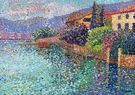

## Multi-style transfer based on the [fast stilization paper]()

To train the network end-to-end only do:

```bash
python train.py
```

...after installing the dependencies. :)

### Docker

The model can be run in a dockerized form:

```bash
sudo docker built -t multi_style . # in project directory
sudo docker run --gpus all --device=/dev/video0:/dev/video0  multi_style
```

It will launch the `run.py` script and will access your webcam and GPU devices. 
You'll need to have `nvidia-docker` installed on your machine.

### Demo videos

Live demo:

[](https://youtu.be/eyMuIuqwkio)

Style | Demo video
:-------:|:-------:
| [](https://www.youtube.com/watch?v=Py-t08dwXF8)

